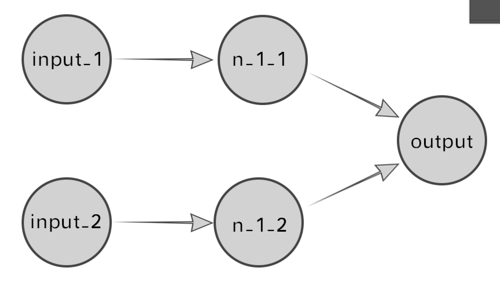

Keras-Keras的初体验


Keras是一个很火的深度学习高级框架，其中包含了几个成熟模型及相关的工具，十分强大。

Keras本身的文档十分棒，直接参考文档能够慢慢的走近Keras的殿堂，这份文档尤其对新手十分友好，甚至细致到指出机器配置，指出阅读文档某一部分需要对哪些知识点有怎样程度的理解。

文档链接：https://keras-cn.readthedocs.io/en/

Sequential（翻译为序贯）模型是一个十分基础款的模型，能够对一些简单的数据进行建模预测。

文档中给出了一个较为简单的例子，由于我只是一个处于入门阶段的小菜鸡，于是决定从一个更加简单的例子入手。

用Sequential模型构造一个“逻辑与门”，也就是布尔代数中的“与”操作。

使用了一个简单的神经网络来进行训练，模拟与门逻辑，根据对应的输入给出输出

可以简单的回顾一下与门，两输入的与门是比较常见的与门，由此可以构造更复杂的多输入与门。当输入端全部输入逻辑True（记为1）的时候输出也为True，当两个输入端中有至少一个是False（记为0），输出为False。

也就有如下的输入输出关系：

| 输入1 | 输入2 | 输出 |
| ----- | ----- | ---- |
| 0     | 0     | 0    |
| 1     | 0     | 0    |
| 0     | 1     | 0    |
| 1     | 1     | 1    |


第一步：

创建一个Sequential模型

```python
from keras.models import Sequential

model = Sequential()
```


第二部：

为模型添加层（Layer）

其实这是一个十分简单的逻辑，应该只需要一个神经元就能够解决（拟合）这个逻辑，但是这边为了多一些尝试使用两层神经元，使用全连接神经元（Dense）

