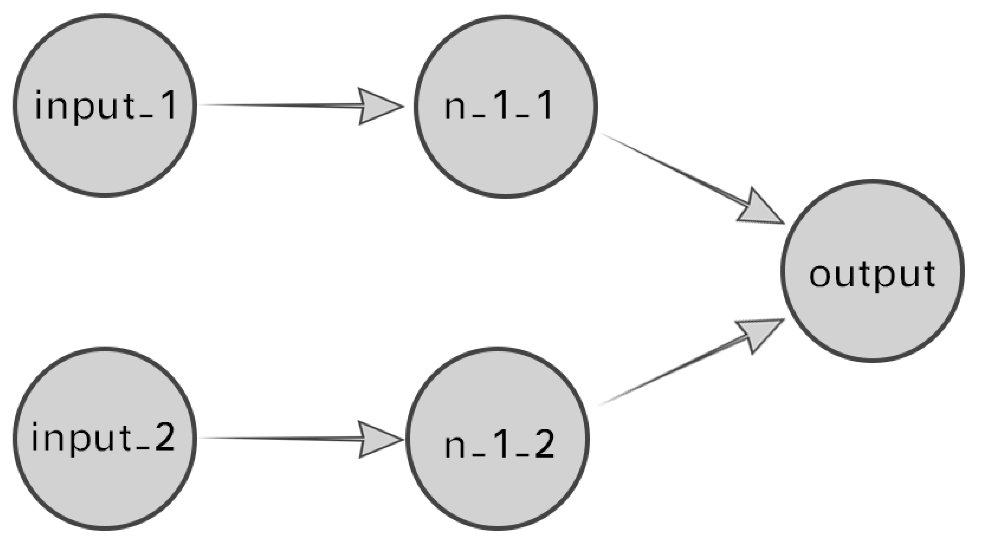
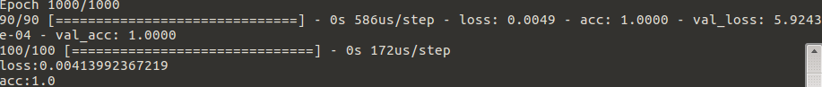
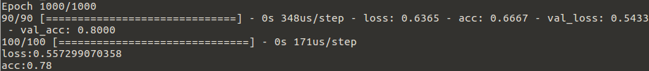

# Keras-Keras的初体验


Keras是一个很火的深度学习高级框架，其中包含了几个成熟模型及相关的工具，十分强大。

Keras本身的文档十分棒，直接参考文档能够慢慢的走近Keras的殿堂，这份文档尤其对新手十分友好，甚至细致到指出机器配置，指出阅读文档某一部分需要对哪些知识点有怎样程度的理解。

文档链接：https://keras-cn.readthedocs.io/en/

Sequential（翻译为序贯）模型是一个十分基础款的模型，能够对一些简单的数据进行建模预测。

文档中给出了一个较为简单的例子，由于我只是一个处于入门阶段的小菜鸡，于是决定从一个更加简单的例子入手。

用Sequential模型构造一个“逻辑与门”，也就是布尔代数中的“与”操作。

使用了一个简单的神经网络来进行训练，模拟与门逻辑，根据对应的输入给出输出

可以简单的回顾一下与门，两输入的与门是比较常见的与门，由此可以构造更复杂的多输入与门。当输入端全部输入逻辑True（记为1）的时候输出也为True，当两个输入端中有至少一个是False（记为0），输出为False。

也就有如下的输入输出关系：

| 输入1 | 输入2 | 输出 |
| ----- | ----- | ---- |
| 0     | 0     | 0    |
| 1     | 0     | 0    |
| 0     | 1     | 0    |
| 1     | 1     | 1    |


#### 第一步：

创建一个Sequential模型

```python
from keras.models import Sequential

model = Sequential()
```


#### 第二步：

为模型添加层（Layer）

其实这是一个十分简单的逻辑，应该只需要一个神经元就能够解决（拟合）这个逻辑，但是这边为了多一些尝试使用两层神经元，使用全连接神经元（Dense）



```python
# 一个全连接层， 有两个神经元，使用relu函数激活，定义的输入参数是一个长度为2的一维向量
model.add(Dense(2, activation="relu", batch_input_shape=(None, 2)))

# 一个全连接输出层，有一个输出神经元，使用sigmoid函数激活，定义输出为一个标量
model.add(Dense(1, activation="sigmoid"))
```


#### 第三步：

设置模型的优化器，损失函数，评估量度及编译模型

```python
# 使用SGD（随机梯度下降法）作为优化器（Optimizer），用来反向反馈怼模型权重参数进行调整
sgd = SGD(lr=0.01, decay=0.0000001, momentum=0.9)
# 使用（binary_crossentropy) 作为损失（loss）函数，计算模型预测值与真实值之间的差距
loss = "binary_crossentropy"
# 使用准确率（accuracy）作为评估模型好坏的量度
measure = "accuracy"
# 编译模型
model.compile(optimizer=sgd, loss=loss, metrics=[measure])
```


#### 第四步：

构造训练数据，将得到一个100x2的矩阵作为data，一个100*1的向量作为label

```python
# lambda表达式计算与门正确输出
lbda = lambda x:x[0]&x[1]
# 输入数据是一组长度为2的向量，向量值只能取0或1
data = np.random.randint(2, size=(100, 2))
# 使用lambda表达式根据输入计算输出
labels = np.array(list(map(lbda, data)))
```


#### 第五步：

进行模型的训练，训练epoch（就是所有数据都用来训练一次为1epoch）指定为1000，并且每次数据的batch指定为32个，从训练数据集中分出10%的数据作为验证集

```python
model.fit(data, labels, epochs=1000, batch_size=32, validation_split=0.1)
```


#### 第六步：

使用测试集计算最终模型的准确度和损失，并且打印结果。

```python
score = model.evaluate(test_data, test_labels, batch_size=32)
print("%s : %s" % (model.metrics_names[0], score[0]))
print("%s : %s" % (model.metrics_names[1], score[1]))
```


如果一切都非常的顺利，1000epochs后可以得到一个实现与门功能的Sequential模型：




由于使用的神经元较少，很容易落入局部最优，多训练几次就能看到模型训练结束的时候准确率达不到100%




问题1: 这其中出现了什么事情呢？我们怎么去定位+解决？

问题2: 为什么每次训练的结果不一样呢？那么科学研究基本凭借的是缘分了？

以上两个问题且听下回分解。


2018-10-30

