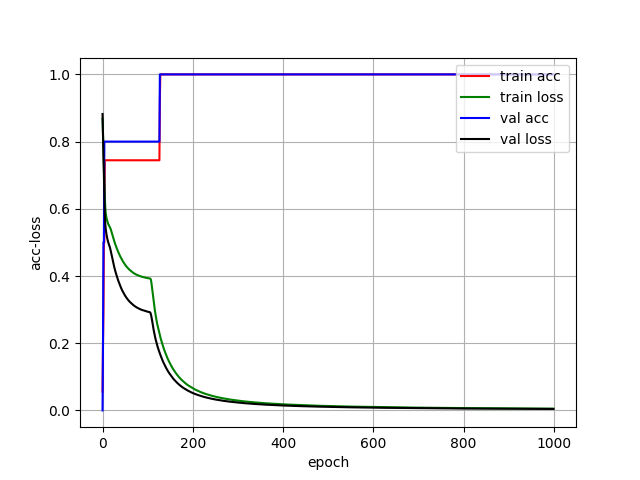
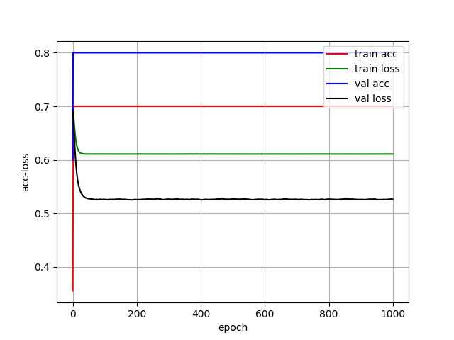

# Keras初体验的Tips


接上回：上回初体验Keras训练一个实现与门逻辑的模型过程中遇到两个问题：

问题1: 训练出来的模型准确率有时候达不到100%？我们怎么去定位+解决这个问题？

问题2: 为什么每次训练的结果不一样呢？那么科学研究基本凭借的是缘分了？


第一个问题，暂时还没有理解透彻，目前所知的理解是模型比较简单，神经元比较小，因此训练的参数设置不当导致模型优化过程中落入局部最优解，并且跑不出来了。


目前还没有学会怎么去定位和解决这个问题，这次这个场景较为简单，仅仅是做一个与门逻辑，我们可以很容易的知道结果跟我们预期不符，应该能够百分百根据输入准确给出输出，那么下次呢，在一个复杂的问题面前，我们怎么去思考呢？


可以想象，可视化可能是帮助解决这个问题的一个很好的工具，先做一个简单的可视化：

参考 https://blog.csdn.net/u013381011/article/details/78911848

做了在模型训练完成后将训练过程中的准确度（acc）和损失（loss）直观的绘制成折线图，直观感受训练的进展。

主要就是引入了一个类用来记录每一个epoch训练完成时模型的状态，并且调用matplotlib进行绘制，类源码在博主原文中有，由于未经博主授权，这边就不贴了。

修改 [Keras-Keras的初体验](./new_to_keras_tips.html)中的如下部分代码

```python
# 实例化
history = LossHistory()
# 训练过程中接受callback
model.fit(data, labels, epochs=1000, batch_size=32, callback=[history], validation_split=0.1)
# 绘制 
history.loss_plot("epoch")
```

通过在模型fit步骤前创建一个该类实例，并且使用callbacks参数将这个类传递给模型接受回调，并且在模型训练完成后调用该类的方法loss_plot("epoch")进行绘制，可以将模型训练过程中的部分情况直观查看。

acc能够达到100%的训练历史如下：



之前提到的acc无法达到100%的情况都训练历史如下：

